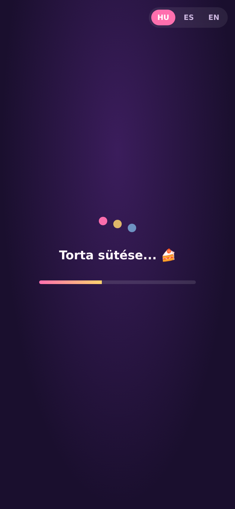
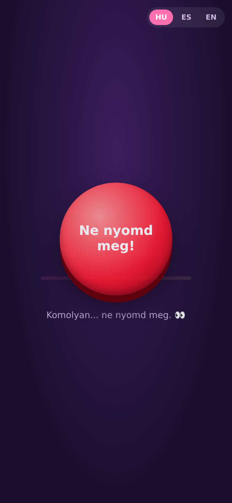
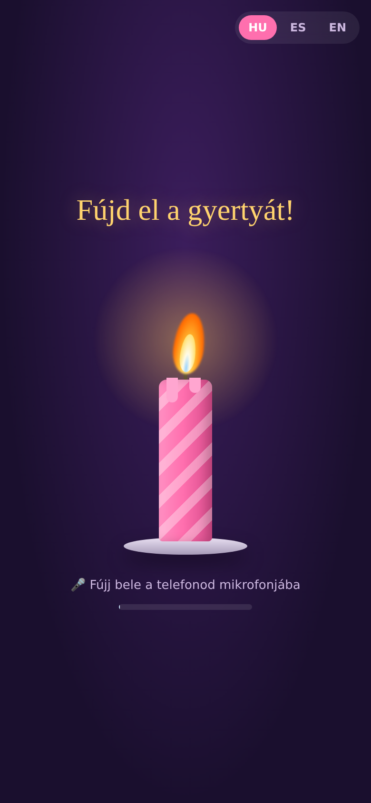
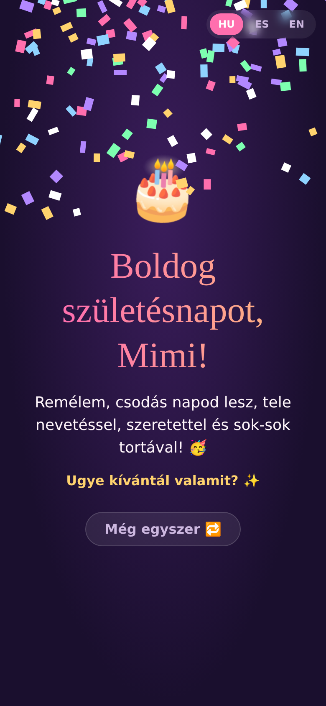

# 🎂 CumpleFeliz — Mimi

Web sorpresa de cumpleaños para Mimi (pensada para móvil).

1. Pantalla de carga con mensajes (húngaro por defecto, también ES / EN).
2. Un botón rojo misterioso: "Ne nyomd meg!" ("¡No lo pulses!").
3. Una vela con la llama movida por el viento: hay que **soplar en el micrófono** para apagarla.
4. Confeti, "Cumpleaños feliz" y el mensaje final.

Es HTML/CSS/JS puro, sin dependencias.

## Publicarla

El micrófono solo funciona con **HTTPS**, así que lo más fácil es GitHub Pages:
Settings → Pages → Source: *Deploy from a branch* → elegir la rama y la carpeta `/ (root)`.

Si el micro no está disponible o no se da permiso, hay que tocar la vela 5 veces para apagarla.

## Probar en local

```bash
python3 -m http.server 8000
# abrir http://localhost:8000
```

## Capturas

| Carga | Botón | Vela | Final |
|---|---|---|---|
|  |  |  |  |
